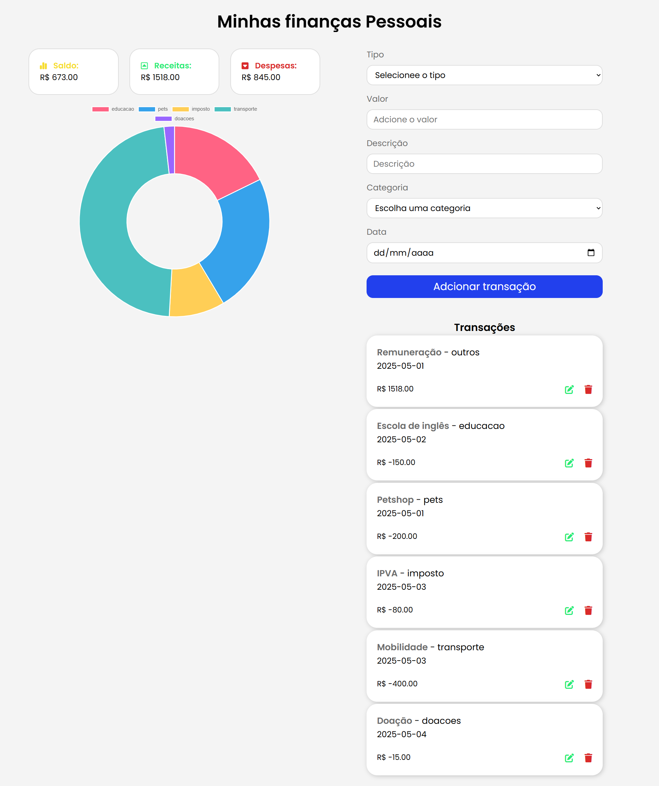

# FinanControl | Dev Éverllon
**FinanControl** é um gerenciador financeiro pessoal simples e intuitivo, ideal para quem quer controlar receitas e despesas de forma visual e prática.

## 🧩 Funcionalidades

- ✅ Cadastro de transações com:
  - Tipo (Receita ou Despesa)
  - Valor
  - Descrição
  - Categoria
  - Data
- ✅ Lista de transações com opção de editar e excluir
- ✅ Cálculo automático de:
  - Saldo total
  - Total de receitas
  - Total de despesas
- ✅ Validações de formulário com feedback via Toastify
- ✅ Gráfico em rosca (Chart.js) para:
  - 📊 Visualizar **despesas por categoria**



## 🛠️ Tecnologias Utilizadas

- Visual Studio Code - para edição do codigo fonte
- **HTML5** + **CSS3 com SASS**
- **JavaScript (ES6)**
- **Chart.js** – biblioteca de gráficos
- **Toastify.js** – para exibir mensagens de feedback
- **Font Awesome** – ícones modernos e intuitivos


## 📁 Estrutura do Projeto

```bash
finanControl/
├── index.html
├── script.js
├── style.css
├── style.css.map
├── style.scss
└── README.md
````

##🚀 Como Usar
Faça o clone do projeto:

```bash
git clone https://github.com/deveverllon/finanControl.git
```
Abra o index.html no seu navegador

### Visualização

👉 Visite a página na web clicando em <a href="https://deveverllon.github.io/finanControl/" target="_blanck"><strong>Preview</strong></a>

Ou copie o link direto no navegador:  
`https://deveverllon.github.io/finanControl/`

## 📌 Melhorias Futuras
 - Gráficos dinâmicos por período
 - Exportar dados em CSV
 - Armazenamento local com banco de dados
 - Tema escuro (modo noturno)

## 👨‍💻 Autor
Desenvolvido por Éverllon (DevEverllon)
🔗 deveverllon.github.io

## 📝 Licença
Este projeto está sob a licença MIT. Sinta-se à vontade para usar, modificar e compartilhar!
